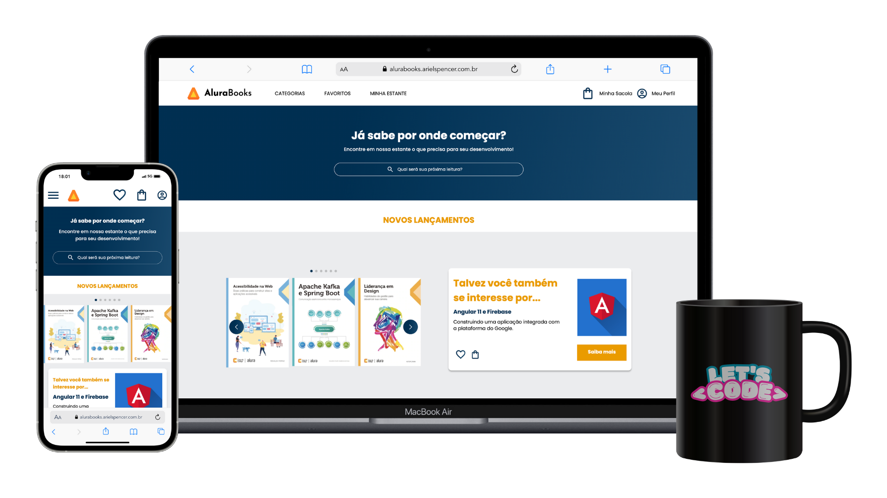

#  AluraBooks

Este é um projeto desenvolvido durante o curso **HTML e CSS: responsividade com mobile-first** da Alura. O objetivo é criar uma interface responsiva utilizando a abordagem mobile-first. 

## Funcionalidades

- Layout responsivo adaptado para diferentes tamanhos de tela.
- Navegação intuitiva utilizando SwiperJS para carrossel de livros.

## Link para o projeto

Você pode acessar o deploy do projeto em: [alurabooks.arielspencer.com.br](https://alurabooks.arielspencer.com.br)

## Contribuição

Contribuições são bem-vindas! Se você tiver sugestões, correções ou melhorias, sinta-se à vontade para abrir uma issue ou enviar um pull request.

# 👾 Tecnologias

  
  
  

# ☕️ Desenvolvido por:

| [ Ariel Spencer](https://arielspencer.com.br/) |
| :---: |

  
  

